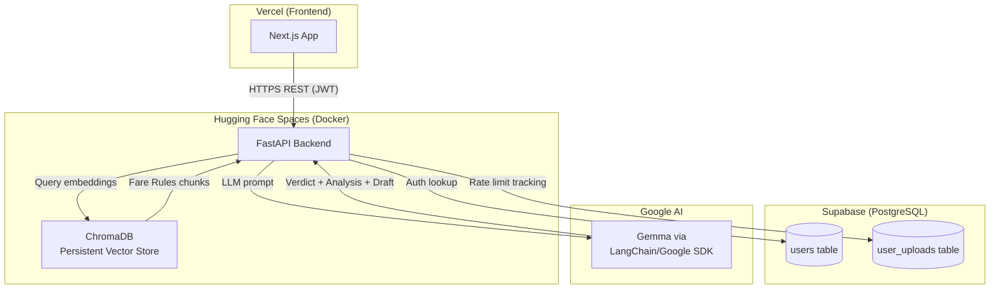
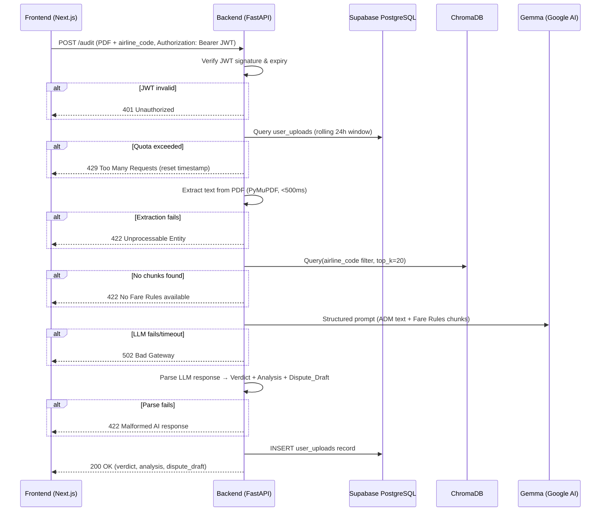

# Design Document: ADM Copilot

## Overview

ADM Copilot is an AI-powered travel audit assistant that automates the investigation of Agency Debit Memos (ADMs). The system uses a Retrieval-Augmented Generation (RAG) architecture to cross-reference an uploaded ADM PDF against pre-ingested airline Fare Rules stored in a vector database, then produces a structured audit verdict and a ready-to-send dispute letter.

### Key Design Goals

- **Zero-cost infrastructure**: Leverage free tiers (Vercel, Hugging Face Spaces, Supabase) to keep operational costs at $0.
- **Security-first**: All audit operations require JWT authentication; rate limiting is enforced exclusively on the backend.
- **Accuracy through grounding**: LLM responses are grounded in retrieved Fare Rules chunks to minimize hallucination.
- **Responsive UX**: Step-by-step progress feedback manages user expectations during 3–6 second LLM generation.

### High-Level Flow

```
Auditor → [Login] → [Select Airline + Upload ADM PDF]
       → [FastAPI: JWT verify → Rate limit check → PDF extract → Vector retrieval → LLM call]
       → [Verdict + Analysis + Dispute Draft displayed in Frontend]
```

---

## Architecture

### System Architecture Diagram



### Deployment Topology

| Component | Host | Notes |
|---|---|---|
| Next.js Frontend | Vercel | Static + SSR, auto-deploy from Git |
| FastAPI Backend | Hugging Face Spaces (Docker) | Single container, persistent disk |
| ChromaDB | Inside HF Spaces Docker image | Initial pre-built data embedded, supports dynamic updates at runtime |
| Supabase PostgreSQL | Supabase Free Tier | `users` and `user_uploads` tables |
| Gemma LLM | Google AI API | Accessed via LangChain/Google Python SDK |


### Request Lifecycle



---

## Components and Interfaces

### Frontend Components (Next.js)

#### `AuthGuard`
- Wraps all protected routes.
- Reads JWT from memory/secure storage on mount.
- Redirects to `/login` if token is absent or expired (checks `exp` claim client-side).
- Clears token on expiry detection.

#### `LoginPage`
- Email + password form.
- Calls `POST /auth/login`.
- On success: stores JWT, redirects to `/dashboard`.
- On 401: displays generic error (no field-level hint).
- On 429: displays lockout message with remaining duration.
- On network error: displays "service temporarily unavailable" without redirecting.

#### `AuditDashboard`
- Top-level page at `/dashboard`.
- Renders `InputPanel` and `ResultsPanel` side-by-side on ≥1280px viewports; stacked on narrower viewports.
- Manages shared state: `processingState`, `auditResult`, `error`.

#### `InputPanel`
- Contains `AirlineSelector` and `FileDropZone`.
- Submit button triggers `POST /audit`.
- Disables all controls during processing.
- Re-enables controls immediately if an error occurs to allow user correction.


#### `AirlineSelector`
- Combobox with type-ahead filtering.
- Accepts airline code (e.g., `GA`) or full name (e.g., `Garuda Indonesia`).
- Shows inline validation error below the control if submitted without selection.

#### `FileDropZone`
- Accepts exactly one `.pdf` file (MIME: `application/pdf`), max 10 MB.
- Replaces existing file on new drop.
- Rejects non-PDF files and multiple simultaneous drops (keeps first).
- Shows inline validation errors below the control.

#### `ProcessingTracker`
- Displays three fixed stages: `"Extracting text..."` → `"Matching rules..."` → `"Querying AI..."`.
- Each stage has one of three states: `pending | active | completed`.
- Exactly one stage is `active` at any time during processing.
- Driven by frontend request state (not SSE).
- Hidden when processing completes or after error dismissal.

#### `ResultsPanel`
- Renders `VerdictBadge`, `AnalysisBlock`, and `DisputeDraftBox`.
- Only visible after a successful audit response.

#### `VerdictBadge`
- Renders exactly one badge at a time (replaces previous on new result).
- `VALID DISPUTE FOUND`: green background, white text.
- `VALID ADM / NO DISPUTE`: red background, white text.
- Hidden entirely if CSS styling cannot be applied.

#### `AnalysisBlock`
- Renders LLM analysis as markdown.
- Must include at least one reference to a specific policy clause, date, booking class, or penalty amount.

#### `DisputeDraftBox`
- Read-only `<textarea>` pre-populated with the LLM-generated dispute email.
- "Copy to Clipboard" button positioned adjacent, visible without scrolling.
- On copy: shows confirmation indicator ("Copied!" or checkmark) for ≥2 seconds, then reverts.

### Backend Components (FastAPI)

#### `POST /auth/login`
- Accepts `{ email, password }`.
- Queries `users` table in Supabase.
- Returns JWT (24h expiry) on success.
- Returns HTTP 401 (generic message) on invalid credentials.
- Returns HTTP 429 with lockout duration after 5 consecutive failures for the same email.

#### `POST /audit`
- Protected endpoint (requires `Authorization: Bearer <JWT>`).
- Orchestrates the full Audit_Pipeline.
- Accepts `multipart/form-data`: `file` (PDF) + `airline_code` (string).

#### `POST /fare-rules`
- Protected endpoint (requires `Authorization: Bearer <JWT>`).
- Accepts `multipart/form-data`: `file` (PDF/text) + `airline_code` (string).
- Triggers dynamic ingestion: parses the file using PyMuPDF, chunks it, and appends to the persistent ChromaDB Vector Store.

#### `GET /airlines`
- Public or Protected endpoint.
- Queries `airlines` table in Supabase.
- Returns a list of supported airlines (code and name) to populate the frontend combobox.


#### `AuthService`
- `verify_jwt(token: str) → UserClaims | None`
- `login(email: str, password: str) → JWT | AuthError`
- `check_lockout(email: str) → LockoutStatus`
- `record_failed_attempt(email: str) → None`

#### `RateLimiter`
- `check_quota(user_email: str) → QuotaStatus`
- `record_upload(user_email: str) → None`
- Reads `MAX_UPLOADS_PER_DAY` from environment (default: 5, valid range: 1–100).
- Uses a 24-hour rolling window based on `last_upload_date`.

#### `PDFExtractor`
- `extract_text(pdf_bytes: bytes) → str | ExtractionError`
- Uses PyMuPDF (`fitz`).
- Must complete in under 500ms.

#### `VectorRetriever`
- `retrieve_chunks(airline_code: str, query_text: str, top_k: int = 20) → list[Chunk]`
- Applies `airline_code` metadata filter.
- Returns empty list if no chunks found (triggers 422 upstream).

#### `LLMOrchestrator`
- `run_audit(adm_text: str, fare_rules_chunks: list[Chunk]) → LLMResponse | LLMError`
- Builds structured prompt.
- Calls Gemma via LangChain/Google Python SDK.
- Parses response into `{ verdict, analysis, dispute_draft }`.

#### `IngestionPipeline` (offline, run at build time)
- `ingest_document(file_path: str, airline_code: str) → None`
- Parses PDF/text with PyMuPDF.
- Chunks text: 1000 chars, 100-char overlap.
- Stores chunks in ChromaDB with `{"airline_code": airline_code}` metadata.

### API Contract

#### `POST /auth/login`

**Request:**
```json
{ "email": "user@example.com", "password": "secret123" }
```

**Response 200:**
```json
{ "access_token": "<JWT>", "token_type": "bearer", "expires_in": 86400 }
```

**Response 401:**
```json
{ "detail": "Invalid credentials." }
```

**Response 429:**
```json
{ "detail": "Account locked. Try again after 2025-01-01T12:00:00Z." }
```

#### `POST /audit`

**Request:** `multipart/form-data`
- `file`: PDF binary
- `airline_code`: string (e.g., `"GA"`)
- Header: `Authorization: Bearer <JWT>`

**Response 200:**
```json
{
  "verdict": "VALID DISPUTE FOUND",
  "analysis": "## Policy Analysis\n\nThe ADM references booking class Y...",
  "dispute_draft": "Dear [Airline Name] Revenue Accounting Team,\n\n..."
}
```

**Error Responses:**
| Status | Condition |
|---|---|
| 401 | JWT invalid or absent |
| 422 | PDF extraction failure, no Fare Rules found, malformed LLM response |
| 429 | Rate limit exceeded (includes `reset_at` timestamp) |
| 502 | LLM call failed or timed out |

#### `POST /fare-rules`

**Request:** `multipart/form-data`
- `file`: PDF or Text binary
- `airline_code`: string (e.g., `"GA"`)
- Header: `Authorization: Bearer <JWT>`

**Response 200:**
```json
{
  "status": "success",
  "message": "Fare rules for GA ingested successfully."
}
```

**Error Responses:**
| Status | Condition |
|---|---|
| 401 | JWT invalid or absent |
| 422 | PDF extraction failure or missing parameters |

#### `GET /airlines`

**Request:** `GET`

**Response 200:**
```json
[
  { "code": "GA", "name": "Garuda Indonesia" },
  { "code": "SQ", "name": "Singapore Airlines" }
]
```


---

## Data Models

### Supabase PostgreSQL

#### `users` table
```sql
CREATE TABLE users (
    id                UUID PRIMARY KEY DEFAULT gen_random_uuid(),
    agent_travel_name TEXT NOT NULL,
    email             TEXT UNIQUE NOT NULL,
    password_hash     TEXT NOT NULL,
    created_at        TIMESTAMPTZ DEFAULT now()
);
```

#### `airlines` table
```sql
CREATE TABLE airlines (
    code       TEXT PRIMARY KEY,
    name       TEXT NOT NULL,
    created_at TIMESTAMPTZ DEFAULT now()
);
```


#### `user_uploads` table
```sql
CREATE TABLE user_uploads (
    id               UUID PRIMARY KEY DEFAULT gen_random_uuid(),
    user_email       TEXT NOT NULL REFERENCES users(email),
    upload_count     INTEGER NOT NULL DEFAULT 1,
    last_upload_date TIMESTAMPTZ NOT NULL DEFAULT now()
);
```

> **Rate-limit query**: Count rows for `user_email` where `last_upload_date >= now() - interval '24 hours'` to determine the rolling window upload count.

#### `login_attempts` table (for lockout tracking)
```sql
CREATE TABLE login_attempts (
    id           UUID PRIMARY KEY DEFAULT gen_random_uuid(),
    email        TEXT NOT NULL,
    attempted_at TIMESTAMPTZ NOT NULL DEFAULT now(),
    success      BOOLEAN NOT NULL DEFAULT false
);
```

> **Lockout query**: Count rows where `email = $1 AND success = false AND attempted_at >= now() - interval '15 minutes'`. If count ≥ 5, account is locked.

### ChromaDB Vector Store

Each document chunk is stored as:
```python
{
    "id": "<uuid>",
    "embedding": [0.123, ...],   # float vector from embedding model
    "document": "<chunk_text>",  # 1000-char chunk with 100-char overlap
    "metadata": {
        "airline_code": "GA",    # required; used as metadata filter
        "source_file": "garuda_fare_rules_2024.pdf",
        "chunk_index": 42
    }
}
```

### Application Data Models (Python / Pydantic)

```python
class UserClaims(BaseModel):
    sub: str          # user email
    exp: int          # Unix timestamp
    iat: int

class QuotaStatus(BaseModel):
    allowed: bool
    current_count: int
    limit: int
    reset_at: datetime | None  # earliest upload + 24h

class Chunk(BaseModel):
    text: str
    airline_code: str
    relevance_score: float

class LLMResponse(BaseModel):
    verdict: Literal["VALID DISPUTE FOUND", "VALID ADM / NO DISPUTE"]
    analysis: str      # markdown string
    dispute_draft: str # plain text email

class AuditResponse(BaseModel):
    verdict: Literal["VALID DISPUTE FOUND", "VALID ADM / NO DISPUTE"]
    analysis: str
    dispute_draft: str
```

### LLM Prompt Structure

```
You are an expert travel auditor. Analyze the following ADM document against the provided Fare Rules.

## ADM Document
{adm_text}

## Relevant Fare Rules (Airline: {airline_code})
{fare_rules_chunks}

## Instructions
1. Determine if the ADM is disputable based on the Fare Rules.
2. Output your response in the following exact format:

VERDICT: <VALID DISPUTE FOUND | VALID ADM / NO DISPUTE>

ANALYSIS:
<Structured markdown analysis referencing specific policy clauses, dates, booking classes, or penalty amounts>

DISPUTE DRAFT:
<Formal business-English email arguing the case for dispute, or a brief note if no dispute is warranted>
```


---

## Correctness Properties

*A property is a characteristic or behavior that should hold true across all valid executions of a system — essentially, a formal statement about what the system should do. Properties serve as the bridge between human-readable specifications and machine-verifiable correctness guarantees.*

### Property 1: Input Validation Rejects Invalid Credentials Format

*For any* string submitted as an email, the Auth_Service SHALL accept it only if it conforms to RFC 5322 format; *for any* string submitted as a password, the Auth_Service SHALL accept it only if its length is at least 8 characters. Any combination that fails either constraint SHALL be rejected before authentication is attempted.

**Validates: Requirements 1.1**

---

### Property 2: JWT Expiry Is Always 24 Hours

*For any* valid user credentials that result in a successful login, the issued JWT SHALL have an `exp` claim equal to `iat + 86400` (24 hours in seconds). No valid login SHALL produce a JWT with a different expiry duration.

**Validates: Requirements 1.2**

---

### Property 3: Invalid Credentials Always Return Generic 401

*For any* combination of email and password that does not match a valid user record, the Auth_Service SHALL return HTTP 401 with a response body that does not contain the words "email", "password", or any other field-specific hint. This property holds regardless of which field is incorrect.

**Validates: Requirements 1.3**

---

### Property 4: Account Lockout After 5 Consecutive Failures

*For any* email address, after exactly 5 or more consecutive failed login attempts within a 15-minute window, the Auth_Service SHALL return HTTP 429 on the next attempt and SHALL NOT return HTTP 401 or 200. The lockout SHALL apply to that email address regardless of the password submitted.

**Validates: Requirements 1.6**

---

### Property 5: Rate Limit Configuration Parsing

*For any* integer value N where 1 ≤ N ≤ 100 set as `MAX_UPLOADS_PER_DAY`, the Rate_Limiter SHALL use N as the quota limit. *For any* absent, non-integer, or out-of-range value of `MAX_UPLOADS_PER_DAY`, the Rate_Limiter SHALL default to 5.

**Validates: Requirements 2.1**

---

### Property 6: Quota Enforcement and Tracking Accuracy

*For any* user email and any configured limit N: (a) after exactly N successful uploads within a 24-hour rolling window, the (N+1)th upload request SHALL be rejected with HTTP 429; (b) each successful upload SHALL increment the `user_uploads` record count by exactly 1; (c) each rejected upload (HTTP 429) SHALL NOT change the `user_uploads` record count; (d) the `reset_at` timestamp in the 429 response SHALL equal the timestamp of the user's earliest upload in the current window plus exactly 24 hours.

**Validates: Requirements 2.2, 2.4, 2.5**

---

### Property 7: Chunking Algorithm Correctness

*For any* text string of length greater than 1000 characters, the Ingestion_Pipeline's chunking function SHALL produce chunks such that: (a) every non-final chunk is exactly 1000 characters long; (b) for any two consecutive chunks i and i+1, the first 100 characters of chunk i+1 are identical to the last 100 characters of chunk i (100-character overlap); (c) the concatenation of all chunks (accounting for overlaps) reconstructs the original text without loss.

**Validates: Requirements 3.2**

---

### Property 8: Airline Code Metadata Integrity

*For any* document ingested with a valid `airline_code`, every chunk stored in the Vector_Store SHALL have `metadata.airline_code` equal to the provided value. *For any* document submitted without a valid `airline_code`, the Ingestion_Pipeline SHALL reject it and no chunks SHALL be stored. *For any* query to the Vector_Store with a given `airline_code`, all returned chunks SHALL have `metadata.airline_code` exactly equal to the queried value, and the count SHALL be at most 20.

**Validates: Requirements 3.3, 3.4**

---

### Property 9: Combobox Filtering Completeness

*For any* search string typed into the airline selector, every option displayed in the dropdown SHALL contain the search string (case-insensitive) in either its airline code or its full airline name. No option that does not match the search string SHALL appear in the filtered list.

**Validates: Requirements 4.1**

---

### Property 10: File Drop Zone Validation

*For any* set of files dropped onto the drop zone: (a) if the set contains one or more PDF files (MIME `application/pdf`, extension `.pdf`) with size ≤ 10 MB, only the first such file SHALL be accepted; (b) any file with MIME type other than `application/pdf` or extension other than `.pdf` SHALL be rejected with a validation error; (c) any file exceeding 10 MB SHALL be rejected with a validation error.

**Validates: Requirements 4.2, 4.5**

---

### Property 11: Request Always Includes JWT in Authorization Header

*For any* valid form submission (valid airline selection + valid PDF file), the outgoing HTTP request to the Backend SHALL always include an `Authorization: Bearer <JWT>` header containing the stored token, the PDF file bytes, and the `airline_code` value. No submission SHALL omit any of these three components.

**Validates: Requirements 4.8**

---

### Property 12: Invalid JWT Always Returns 401

*For any* request to `POST /audit` with an absent, expired, or malformed JWT, the Backend SHALL return HTTP 401 and SHALL NOT execute any step of the Audit_Pipeline (no PDF extraction, no vector retrieval, no LLM call, no database write).

**Validates: Requirements 5.2**

---

### Property 13: ADM Text Extraction Performance

*For any* valid PDF document submitted to the PDFExtractor, the time elapsed from when the PDF bytes are available in memory to when raw text is returned SHALL be less than 500 milliseconds.

**Validates: Requirements 5.4**

---

### Property 14: Prompt Contains All Required Context

*For any* ADM text string and any non-empty list of Fare Rules chunks, the structured prompt compiled by the LLMOrchestrator SHALL contain the complete ADM text and the complete text of every retrieved chunk. No ADM text or chunk text SHALL be truncated or omitted from the prompt.

**Validates: Requirements 5.6**

---

### Property 15: LLM Response Parsing Round-Trip

*For any* well-formed LLM response string that contains a `VERDICT:` section, an `ANALYSIS:` section, and a `DISPUTE DRAFT:` section, the parser SHALL extract all three components as non-empty strings. The parsed `verdict` SHALL be exactly one of `"VALID DISPUTE FOUND"` or `"VALID ADM / NO DISPUTE"`.

**Validates: Requirements 5.7**

---

### Property 16: Audit Pipeline Error Handling

*For any* error condition in the Audit_Pipeline: (a) a PDF that fails text extraction SHALL produce HTTP 422 with a descriptive message; (b) an `airline_code` with no matching chunks in the Vector_Store SHALL produce HTTP 422; (c) an LLM call that fails or times out SHALL produce HTTP 502; (d) an LLM response that cannot be parsed into the three required components SHALL produce HTTP 422. In all error cases, no partial result SHALL be returned and the `user_uploads` counter SHALL NOT be incremented.

**Validates: Requirements 5.8, 5.9, 5.10, 5.11**

---

### Property 17: Exactly One Verdict Badge at All Times

*For any* sequence of audit results rendered in the Frontend, the DOM SHALL contain exactly one verdict badge element at any point in time. Rendering a new result SHALL remove the previous badge before inserting the new one, so the badge count never exceeds 1.

**Validates: Requirements 6.1**

---

### Property 18: Analysis Content Preservation

*For any* analysis string returned by the LLM that contains references to policy clauses, dates, booking classes, or penalty amounts, the rendered markdown output in the Frontend SHALL preserve and display all such references without truncation or omission.

**Validates: Requirements 6.4**

---

### Property 19: Clipboard Copy Completeness

*For any* dispute draft text of any length, clicking the "Copy to Clipboard" button SHALL result in the system clipboard containing the complete, untruncated dispute draft text. The character count of the clipboard content SHALL equal the character count of the original dispute draft string.

**Validates: Requirements 6.7**

---

### Property 20: Processing Tracker State Invariant

*For any* point in time during Audit_Pipeline execution: (a) the processing tracker SHALL display exactly three stages in the fixed order "Extracting text...", "Matching rules...", "Querying AI..."; (b) exactly one stage SHALL be in the `active` state; (c) no stage SHALL be simultaneously in two states; (d) stages SHALL only transition forward (pending → active → completed) and SHALL never revert to a previous state.

**Validates: Requirements 7.1, 7.2**

---

### Property 21: Input Controls Disabled During Processing

*For any* point in time while an audit request is in-flight (from submission until response received), all three input controls — the submit button, the file drop zone, and the airline selector — SHALL be in a disabled state. None of the three controls SHALL be interactive during this period.

**Validates: Requirements 7.3**

---

## Error Handling

### Authentication Errors

| Scenario | Backend Response | Frontend Behavior |
|---|---|---|
| Invalid credentials | HTTP 401, generic message | Show generic error on login page; no field hint |
| 5+ consecutive failures | HTTP 429, lockout duration | Show lockout message with remaining time |
| Auth service unavailable | Network error | Show "service temporarily unavailable"; stay on login page |
| JWT expired (client-side) | — | Redirect to login, clear token |
| JWT invalid (server-side) | HTTP 401 | Redirect to login, clear token |

### Rate Limiting Errors

| Scenario | Backend Response | Frontend Behavior |
|---|---|---|
| Quota exceeded | HTTP 429, `reset_at` timestamp | Inline message on current page with reset time; no navigation |

### Audit Pipeline Errors

| Scenario | Backend Response | Frontend Behavior |
|---|---|---|
| PDF extraction failure | HTTP 422, descriptive message | Show error in processing area; re-enable input controls immediately |
| No Fare Rules for airline | HTTP 422, "no rules available" | Show error; re-enable input controls immediately |
| LLM failure/timeout | HTTP 502, "AI service unavailable" | Show error; re-enable input controls immediately |
| Malformed LLM response | HTTP 422, "malformed AI response" | Show error; re-enable input controls immediately |

### Input Validation Errors (Frontend)

| Scenario | Frontend Behavior |
|---|---|
| No airline selected on submit | Inline error below airline selector; prevent submission |
| No file on submit | Inline error below drop zone; prevent submission |
| Non-PDF file dropped | Inline error below drop zone; reject file |
| File > 10 MB | Inline error below drop zone; reject file |
| Multiple files dropped | Accept first file only; discard rest silently |

### Error Recovery Flow

```
Error occurs during processing
  → Backend returns error response
  → Frontend: display error message with dismiss control
  → Frontend: immediately re-enable submit button, drop zone, airline selector
  → User can correct input and retry immediately
  → User clicks dismiss: hide error + processing tracker
```


---

## Testing Strategy

### Overview

The testing strategy uses a dual approach: **property-based tests** for universal correctness properties and **example-based unit/integration tests** for specific behaviors, edge cases, and UI interactions.

### Backend Testing (Python / pytest + Hypothesis)

**Property-Based Testing Library**: [Hypothesis](https://hypothesis.readthedocs.io/) for Python

Each property-based test runs a minimum of **100 iterations** with randomized inputs.

**Tag format**: `# Feature: adm-copilot, Property {N}: {property_text}`

#### Unit Tests (pytest)

- `AuthService`: valid login, invalid login, lockout logic, JWT generation and verification
- `RateLimiter`: quota check, counter increment, reset timestamp calculation, env var parsing
- `PDFExtractor`: valid PDF extraction, corrupt PDF handling, performance benchmark
- `VectorRetriever`: airline_code filter correctness, empty result handling
- `LLMOrchestrator`: prompt construction, response parsing (well-formed and malformed), error handling
- `IngestionPipeline`: chunking algorithm, metadata tagging, document rejection without airline_code

#### Property-Based Tests (Hypothesis)

```python
# Property 1: Input validation
@given(email=st.text(), password=st.text())
def test_credential_format_validation(email, password): ...

# Property 2: JWT expiry
@given(user=valid_user_strategy())
def test_jwt_expiry_is_24h(user): ...

# Property 3: Generic 401 message
@given(email=st.emails(), password=st.text())
def test_invalid_credentials_generic_message(email, password): ...

# Property 4: Account lockout
@given(email=st.emails())
def test_lockout_after_5_failures(email): ...

# Property 5: Rate limit config parsing
@given(value=st.one_of(st.integers(1, 100), st.text(), st.none()))
def test_rate_limit_config_parsing(value): ...

# Property 6: Quota enforcement
@given(email=st.emails(), limit=st.integers(1, 10))
def test_quota_enforcement_and_tracking(email, limit): ...

# Property 7: Chunking algorithm
@given(text=st.text(min_size=1001))
def test_chunking_correctness(text): ...

# Property 8: Airline code metadata
@given(airline_code=st.text(min_size=2, max_size=3), doc=valid_document_strategy())
def test_airline_code_metadata_integrity(airline_code, doc): ...

# Property 12: Invalid JWT → 401
@given(token=st.one_of(st.none(), st.text(), expired_jwt_strategy()))
def test_invalid_jwt_returns_401(token): ...

# Property 13: Extraction performance
@given(pdf=valid_pdf_strategy())
def test_extraction_under_500ms(pdf): ...

# Property 14: Prompt completeness
@given(adm_text=st.text(min_size=1), chunks=st.lists(chunk_strategy(), min_size=1))
def test_prompt_contains_all_context(adm_text, chunks): ...

# Property 15: LLM response parsing
@given(response=well_formed_llm_response_strategy())
def test_llm_response_parsing_roundtrip(response): ...

# Property 16: Error handling
@given(pdf=corrupt_pdf_strategy())
def test_extraction_failure_returns_422(pdf): ...
```

#### Integration Tests

- Full audit pipeline with mocked LLM: valid request → 200 with all three components
- Rate limit enforcement: N+1 request → 429 with correct reset timestamp
- JWT verification middleware: invalid token → 401, no pipeline execution
- ChromaDB airline_code filter: cross-airline contamination check

### Frontend Testing (Jest + React Testing Library + fast-check)

**Property-Based Testing Library**: [fast-check](https://fast-check.io/) for TypeScript/JavaScript

#### Unit Tests (Jest + RTL)

- `LoginPage`: valid submit, invalid credentials display, lockout display, service unavailable display
- `AirlineSelector`: renders options, filters on input, shows validation error
- `FileDropZone`: accepts PDF, rejects non-PDF, rejects oversized, replaces on re-drop
- `VerdictBadge`: green for VALID DISPUTE FOUND, red for VALID ADM / NO DISPUTE
- `ProcessingTracker`: renders three stages, stage state transitions
- `DisputeDraftBox`: read-only textarea, copy button, confirmation indicator

#### Property-Based Tests (fast-check)

```typescript
// Property 9: Combobox filtering
fc.assert(fc.property(fc.string(), (query) => {
  // All displayed options contain query in code or name
}));

// Property 10: File drop zone validation
fc.assert(fc.property(fc.array(fileArbitrary()), (files) => {
  // Only first valid PDF ≤10MB is accepted
}));

// Property 11: Request includes JWT
fc.assert(fc.property(validFormStateArbitrary(), (formState) => {
  // Outgoing request always has Authorization header
}));

// Property 17: Exactly one badge
fc.assert(fc.property(fc.array(auditResultArbitrary(), { minLength: 1 }), (results) => {
  // DOM always has exactly one badge after rendering each result
}));

// Property 18: Analysis content preservation
fc.assert(fc.property(analysisWithReferencesArbitrary(), (analysis) => {
  // Rendered markdown preserves all policy references
}));

// Property 19: Clipboard copy completeness
fc.assert(fc.property(fc.string(), (disputeDraft) => {
  // Clipboard content equals original string character-for-character
}));

// Property 20: Processing tracker state invariant
fc.assert(fc.property(processingStateArbitrary(), (state) => {
  // Exactly one stage active, no backward transitions
}));

// Property 21: Controls disabled during processing
fc.assert(fc.property(inFlightStateArbitrary(), (state) => {
  // All three controls are disabled
}));
```

#### Responsive Layout Tests

- Viewport 1280px+: two-column layout, all panels visible without scroll
- Viewport <1280px: single-column layout, no horizontal overflow
- Viewport 375px: all controls reachable and usable

### Test Coverage Targets

| Layer | Unit/Example | Property-Based |
|---|---|---|
| AuthService | ≥90% line coverage | Properties 1–4 |
| RateLimiter | ≥90% line coverage | Properties 5–6 |
| PDFExtractor | ≥85% line coverage | Properties 13, 16 |
| VectorRetriever | ≥85% line coverage | Property 8 |
| LLMOrchestrator | ≥85% line coverage | Properties 14–16 |
| IngestionPipeline | ≥90% line coverage | Properties 7–8 |
| Frontend Components | ≥80% line coverage | Properties 9–11, 17–21 |
